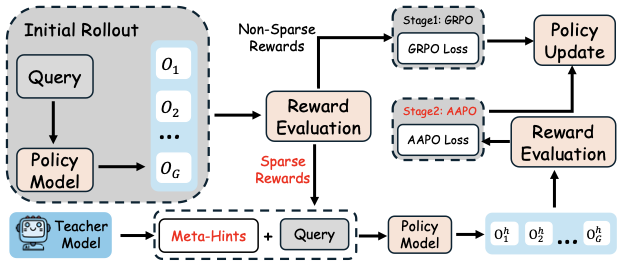
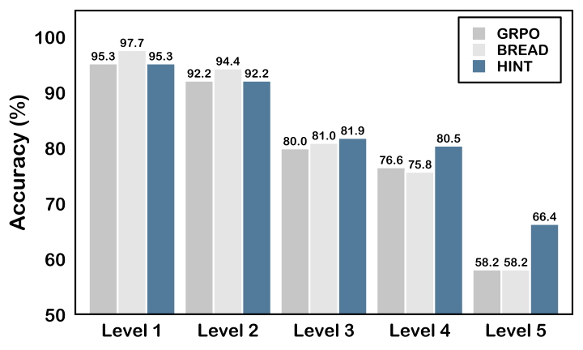

# HINT: Helping Ineffective Rollouts Navigate Toward Effectiveness

Official code for the ACL 2026 submission **HINT**, an adaptive reinforcement learning framework that replaces answer-revealing supervision with heuristic **Meta-Hints**. Instead of telling the model the partial solution directly, HINT nudges exploration while preserving higher training affinity and more stable policy updates.

Code: [https://github.com/ViviqwerAsd/HINT](https://github.com/ViviqwerAsd/HINT)

## Overview

HINT is built around two ideas:

- **Meta-Hints instead of Answer-Hints**: provide high-level guidance without exposing intermediate solution content.
- **Affinity-Aware Policy Optimization (AAPO)**: down-weight hint-guided updates that are less compatible with the model's current policy.

This repository contains:

- the HINT training pipeline (`rl_hint.py`, `lsrl_hint.py`)
- the reference log-probability server used for PPO-style updates (`ref_server.py`)
- multi-benchmark evaluation (`eval.py`)
- a lightweight run script (`run_hint.sh`)

## Framework



## Main Results

HINT consistently improves over GRPO and strong answer-guided baselines across three model backbones.

| Backbone | In-distribution Avg. | OOD Avg. |
| --- | ---: | ---: |
| Qwen2.5-7B + GRPO | 39.9 | 55.1 |
| Qwen2.5-7B + HINT | **42.9** | **57.3** |
| Qwen2.5-3B + GRPO | 29.0 | 42.2 |
| Qwen2.5-3B + HINT | **33.8** | **44.9** |
| LLaMA3.1-8B + GRPO | 10.6 | 43.1 |
| LLaMA3.1-8B + HINT | **12.8** | **48.2** |

HINT also shows stronger gains on harder reasoning problems:



## Installation

Create the environment with Conda:

```bash
conda env create -f environment.yml
conda activate hint
```

The environment file is based on the setup used for the paper and includes `torch`, `transformers`, `vllm`, `ray`, and `math-verify`.

## Data Format

Training expects a JSONL file where each line contains:

```json
{
  "question": "...",
  "answer": "...",
  "abstract_hint": "..."
}
```

By default, the training script looks for `./data/dapo-selected-10k.jsonl`. Datasets are not included in this public repository.

Evaluation datasets are resolved relative to `./data` by default. You can override the root with:

```bash
export HINT_DATA_ROOT=/path/to/eval_datasets
```

## Training

Start the reference server in one terminal:

```bash
CUDA_VISIBLE_DEVICES=0 python ref_server.py \
  --model-path Qwen/Qwen2.5-7B \
  --port 59888
```

Launch HINT training in another terminal:

```bash
CUDA_VISIBLE_DEVICES=1 python rl_hint.py train \
  --model-path Qwen/Qwen2.5-7B \
  --data-file ./data/dapo-selected-10k.jsonl \
  --ref-url http://127.0.0.1:59888 \
  --save-path ./outputs/hint-qwen2.5-7b \
  --gen-devices 1 \
  --rollout-num 8 \
  --train-batch-size 8 \
  --gen-batch-size 32 \
  --gen-update-steps 128 \
  --affinity-lambda 1.0
```

Or use the helper script:

```bash
bash run_hint.sh
```

If you want SwanLab logging, set `SWANLAB_API_KEY` in the environment before training and pass `--swanlab-project`.

## Evaluation

Run multi-task evaluation with Ray + vLLM:

```bash
python eval.py \
  --model_path ./outputs/hint-qwen2.5-7b/step_2560 \
  --tasks math500 aime24 olympiad minerva gpqa_d arc_c mmlu_pro \
  --num_workers 2 \
  --batch_size 64 \
  --use_chat_template
```

You can optionally provide a JSON config to override per-task sampling settings:

```bash
python eval.py \
  --model_path ./outputs/hint-qwen2.5-7b/step_2560 \
  --tasks aime24 \
  --task_config_path ./task_config.json
```

For a quick GSM8K sanity check on a checkpoint:

```bash
python rl_hint.py gsm8k-test \
  --model-path ./outputs/hint-qwen2.5-7b/step_2560 \
  --limit 200
```

## Notes

- `lsrl_hint.py` contains the HINT rollout logic, Affinity metric logging, and AAPO weighting.
- `rl_hint.py` is the recommended entrypoint for training, running the reference server, and quick GSM8K checks.
- `eval.py` expects benchmark files to follow the `question/problem` and `answer/target` schema used in the paper experiments.

## Citation

```bibtex
@inproceedings{wang-etal-2026-guide-rollouts,
  title = {Don't Tell the Answer, Truly Guide the Reasoning During RL Rollouts},
  author = {Wang, Xinyi and Han, Jinyi and Jiang, Zishang and Li, Tingyun and Liang, Jiaqing and Jiang, Sihang and Dai, Zhaoqian and Ma, Shuguang and Yu, Fei and Xiao, Yanghua},
  booktitle = {Findings of the Association for Computational Linguistics: ACL 2026},
  year = {2026}
}
```
